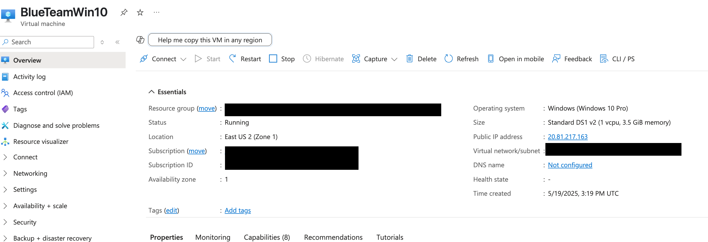
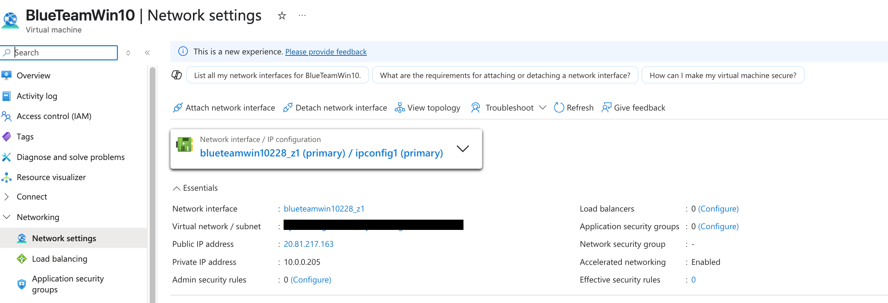
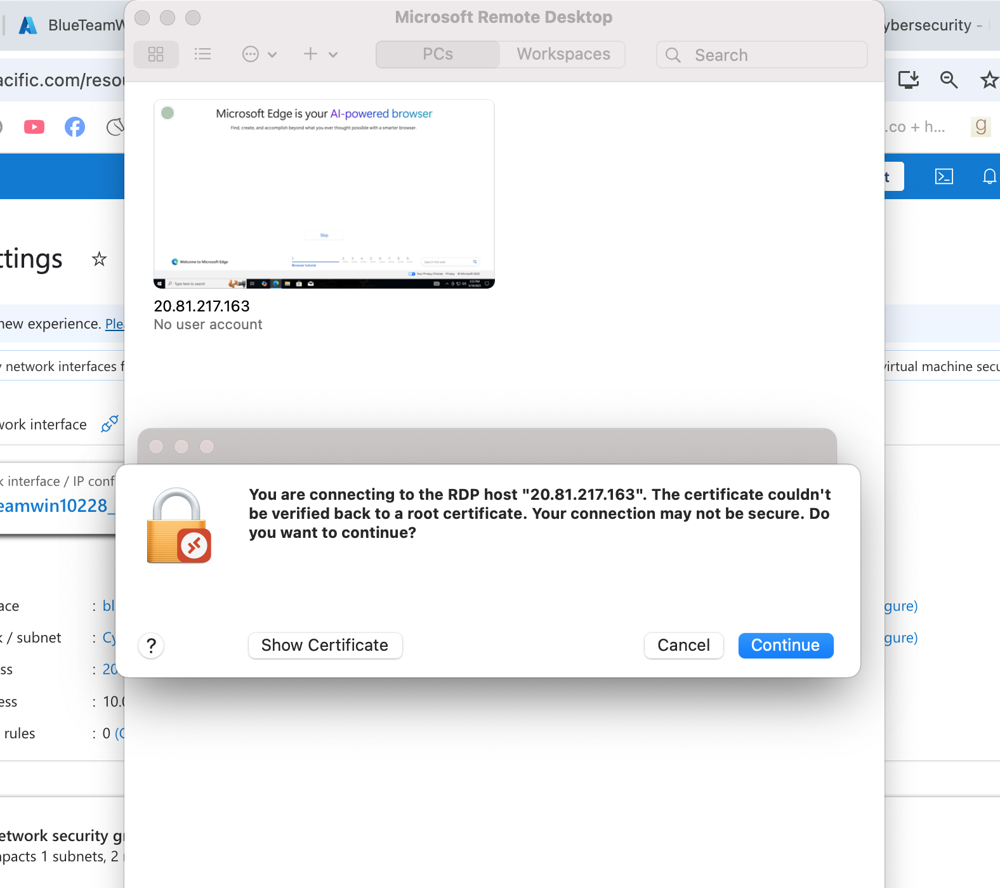
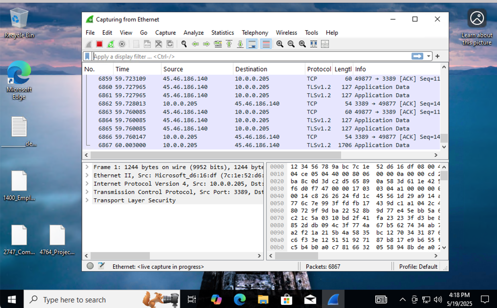
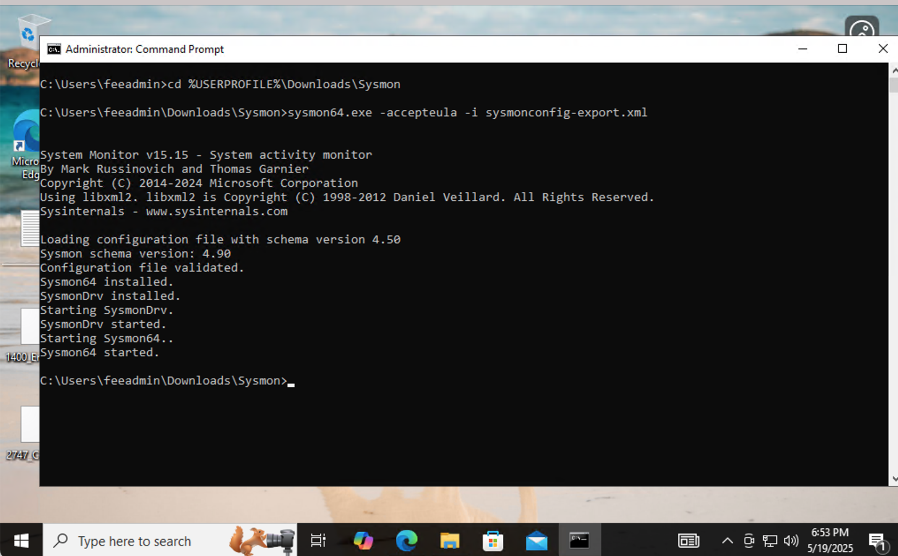
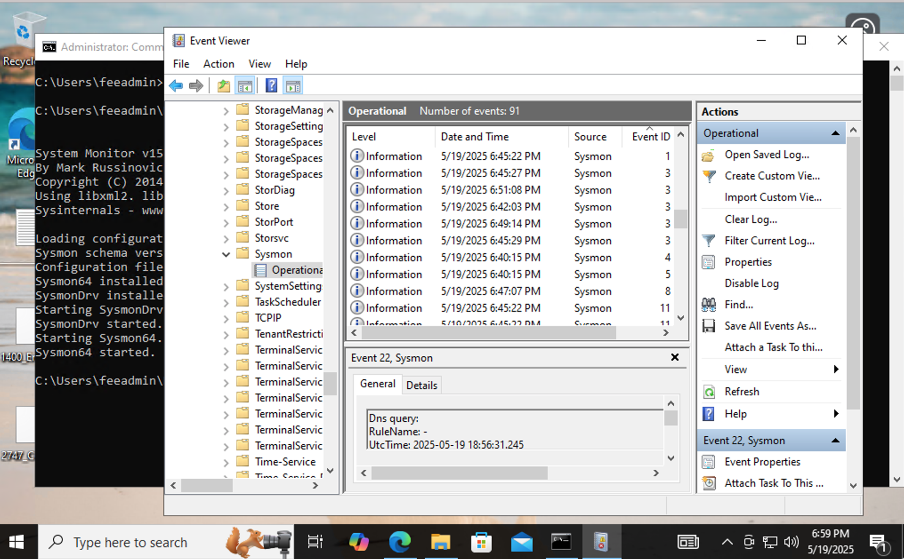
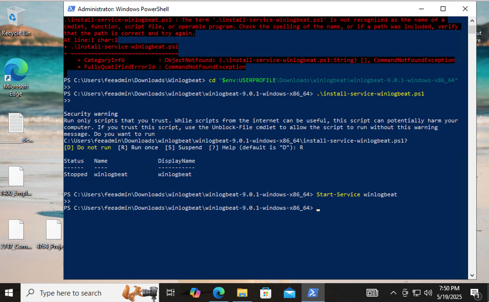
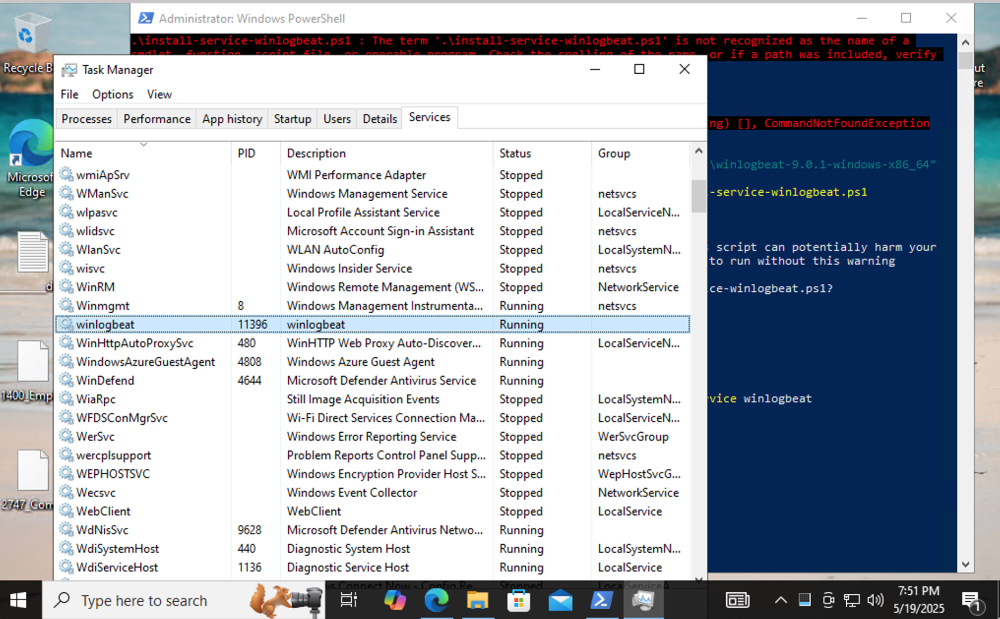

# 💽 Virtual Machine Security Lab (Azure-Based)

## 🧠 About This Project

This is Phase 1 of an evolving cloud-based blue team lab designed to sharpen my cybersecurity skills using real-world tools and infrastructure.

I created and configured a Windows 10 virtual machine in Microsoft Azure and installed key monitoring tools to simulate log collection, packet inspection, and system visibility — all essential components of a defensive security environment.

---

## ☁️ Lab Setup

**Platform:** Microsoft Azure  
**Operating System:** Windows 10 Pro  
**Tools Installed:**
- 🐬 **Wireshark** – for packet capture and live network traffic inspection
- 🔒 **Sysmon** – for system-level logging (process, DNS, network events)
- 📤 **Winlogbeat** – for log forwarding and SIEM prep

---

## 🔧 What I Did

- Deployed a cloud VM in Azure (B1s)
- Configured RDP for secure access (Port 3389)
- Installed and validated Wireshark live captures
- Installed Sysmon with a custom config (SwiftOnSecurity)
- Verified Sysmon logs using Windows Event Viewer
- Installed Winlogbeat and confirmed background service operation
- Created a network topology diagram to visualize the lab architecture

---

## 🖼️ Screenshots

### ✅ Azure VM Overview

### 🌐 Network Configuration

### 🔐 RDP Connection Warning

### 🐬 Wireshark Live Capture

### 🔒 Sysmon Installation

### 📊 Sysmon Logs in Event Viewer

### 📤 Winlogbeat Service Install

### 🟢 Winlogbeat Running in Services

---

## 🧭 Lab Architecture: Network Topology

This diagram visualizes how the Azure VM is structured, what tools are installed, and how traffic flows through the environment. It helps demonstrate that this lab was thoughtfully designed to simulate a real-world blue team monitoring setup.

---

## 🚀 Phase 2: Internal Lab Expansion (Coming Soon)

In the next phase, I plan to introduce a second virtual machine to simulate lateral movement and internal traffic monitoring.

### 🔄 Goals for Phase 2:
- Add a second VM (e.g., File Server or Domain Controller)
- Simulate traffic between VMs inside a shared VNet
- Enable more advanced log collection and alerting
- Begin integrating SIEM concepts and correlation

---

## 🎨 The Creative Angle

I approach cybersecurity from the intersection of **creativity and technology** — this lab is one of many ways I explore that blend. Each build is part learning, part storytelling, and all hands-on growth.

---

## 📫 Let's Connect
If you're reviewing this and want to talk tech, security, or ideas — feel free to reach out!

